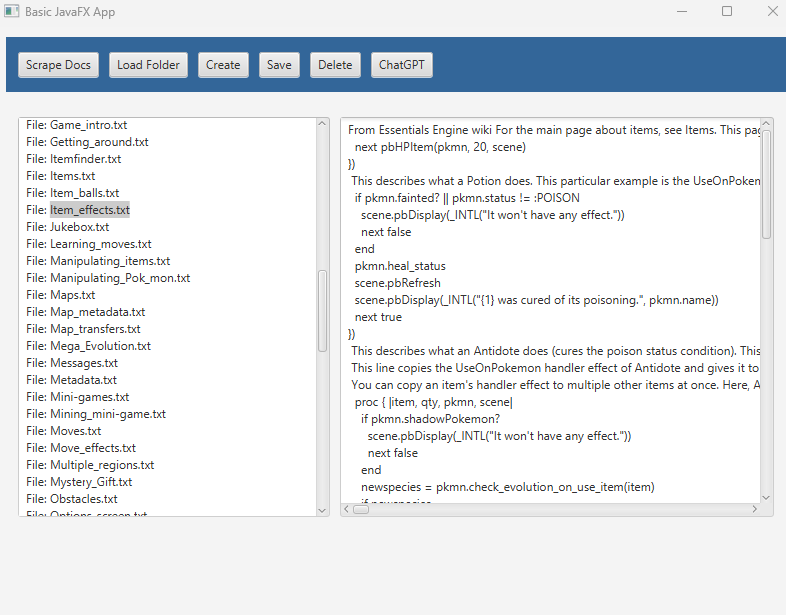
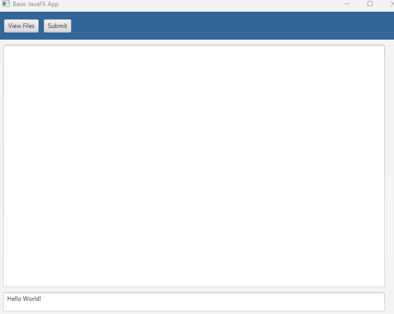

# Overview 
This project is a Java-based web scraper that extracts data from the Essentials Docs Wiki using the JSoup library. The scraper navigates through specified web pages, retrieves relevant information, and saves the content to text files for further analysis or reference.

