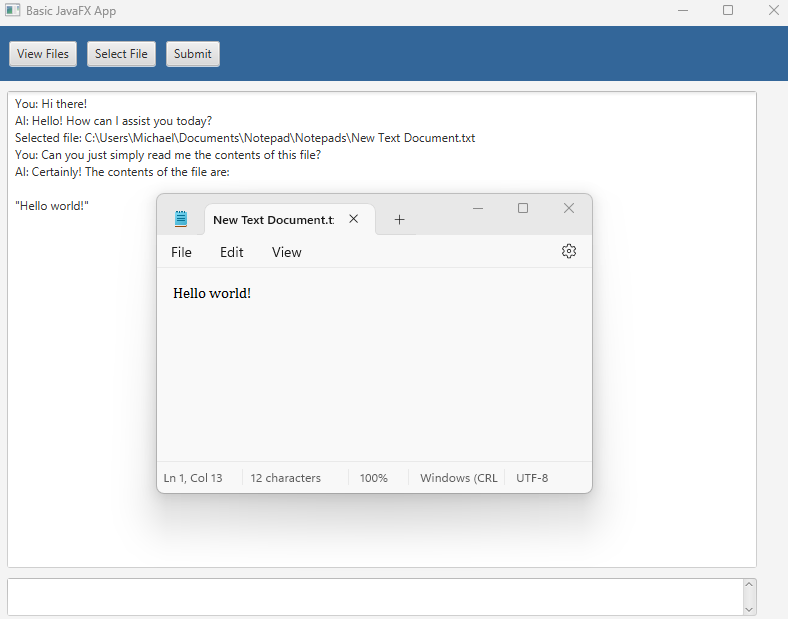

# Overview 
This project is a Java-based web scraper that extracts data from the Essentials Docs Wiki using the JSoup library. 
The scraper navigates through specified web pages, retrieves relevant information, and saves the content to text files 
for further analysis or reference. This project is a JavaFX application that allows users to load, view, and edit text 
files from their local directory. Additionally, it integrates OpenAI's GPT-3.5-turbo model to provide AI-based responses
based on the contents of the selected text files.

# Features

Load Local Directory: Users can load a directory from their local file system and view its contents.
View and Edit Files: Users can view the contents of selected text files and edit them within the application.
AI Integration: Utilizes OpenAI's GPT-3.5-turbo model to generate responses based on the content of the loaded text files.
File Operations: Create, save, and delete files directly from the application interface.
Web Scraping: Scrapes from a Pokemon Documentation Wiki page and saves data into text files.

# Technologies Used

JavaFX: For building the graphical user interface.
Maven: For project management and dependency handling.
OkHttp: For making HTTP requests to the OpenAI API.
OpenAI API: For AI-based text processing and generation.
Jsoup: For scraping contents from the wiki pages.